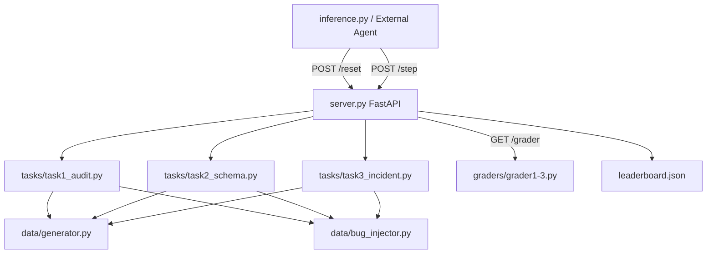
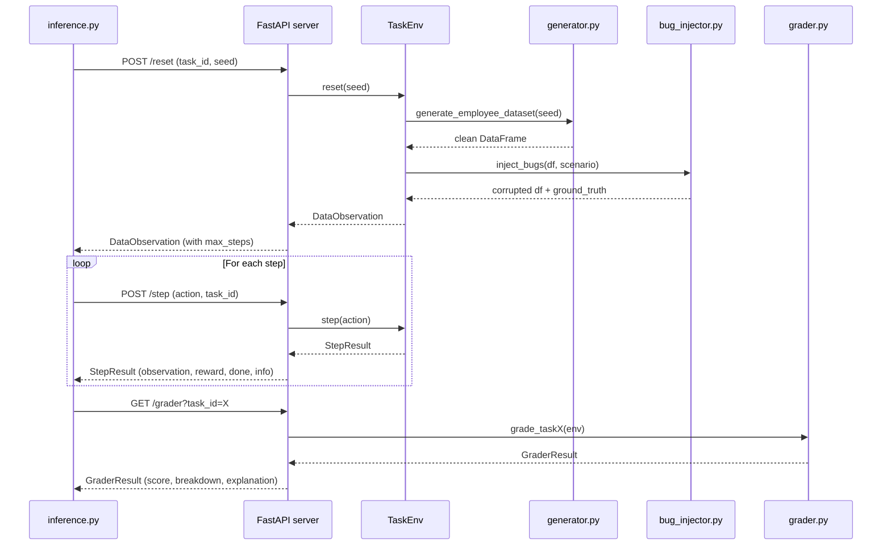

# DataPipelineEnv — Architecture

## System Overview



## Request Flow



## File Structure

```
├── env/
│   ├── __init__.py
│   ├── models.py           # Pydantic models: DataAction, DataObservation, StepResult, etc.
│   ├── server.py           # FastAPI endpoints: /reset, /step, /grader, /demo, etc.
│   ├── data/
│   │   ├── generator.py    # Seed-parameterized employee dataset generation
│   │   ├── bug_injector.py # Bug injection + procedural scenario generation
│   │   └── scenarios/      # Static JSON scenarios (used by /demo only)
│   ├── graders/
│   │   ├── grader1.py      # Task 1 scorer: identification + remediation
│   │   ├── grader2.py      # Task 2 scorer: rows_passing + column_recovery + type_correctness
│   │   └── grader3.py      # Task 3 scorer: diagnosis + fix + pii + validation + bonuses
│   └── tasks/
│       ├── task1_audit.py   # Data Quality Audit (easy, 10 steps)
│       ├── task2_schema.py  # Schema Drift Remediation (medium, 15 steps)
│       └── task3_incident.py# Full Data Incident Response (hard, 20 steps)
├── inference.py             # LLM agent loop with belief state tracking
├── scripts/
│   ├── validate_diversity.py# Scenario diversity validation
│   └── benchmark.py        # Automated benchmarking
├── tests/
│   ├── test_env.py          # Environment unit tests
│   ├── test_inference.py    # Inference + grader tests
│   └── test_grader2.py      # Grader 2 specific tests
├── docs/
│   ├── architecture.md      # This file
│   └── reward_design.md     # Complete reward table
├── openenv.yaml             # OpenEnv specification
├── Dockerfile               # Container deployment
└── README.md                # Project documentation
```

## Deployment Model

- **Workers**: 1 (required — state is in-process)
- **State backend**: In-process dict (`_envs`)
- **Leaderboard backend**: File-backed (`leaderboard.json`)
- **Port**: 7860 (default for HF Spaces)
